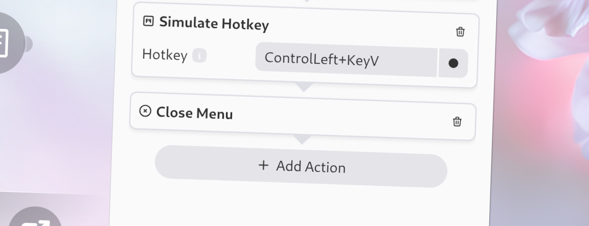

import Intro from '../../../components/Intro.astro';
import { Icon } from 'astro-icon/components';
import { Aside } from '@astrojs/starlight/components';



<Intro>
This action closes the current menu. Usually, you will use this action in most of your workflows.
</Intro>

<Aside type="tip">
If you want an action to target another window, you should place it after the Close-Menu action to ensure that the menu is closed before the action is executed.
</Aside>

You can choose deliberately to not close the menu after executing a workflow.
Just remove the Close-Menu action from the workflow and the menu will stay open after executing the workflow!

## <Icon name="solar:check-circle-bold-duotone" class="inline-icon" /> Options

This action has no options.

## <Icon name="solar:settings-bold-duotone" class="inline-icon" /> JSON Configuration

If you edit your [`menus.json`](/config-files) file by hand or use the [IPC interface](/ipc-interface), you can create this action with something like the following.

```json title="menus.json" {5-7}
...
"selectWorkflow": {
  "actions": [
    ...
    {
      "type": "close-menu"
    }
    ...
  ]
}
...
```