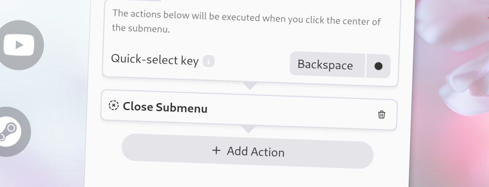

import Intro from '../../../components/Intro.astro';
import { Icon } from 'astro-icon/components';



<Intro>
This action closes the current submenu. This means, you will return to the parent menu of the current submenu.
</Intro>

This action is often used for the Center-Click workflow of a submenu, so that the submenu is closed when the user clicks on the center of a menu.

## <Icon name="solar:check-circle-bold-duotone" class="inline-icon" /> Options

This action has no options.

## <Icon name="solar:settings-bold-duotone" class="inline-icon" /> JSON Configuration

If you edit your [`menus.json`](/config-files) file by hand or use the [IPC interface](/ipc-interface), you can create this action with something like the following.

```json title="menus.json" {5-7}
...
"selectWorkflow": {
  "actions": [
    ...
    {
      "type": "close-submenu"
    }
    ...
  ]
}
...
```