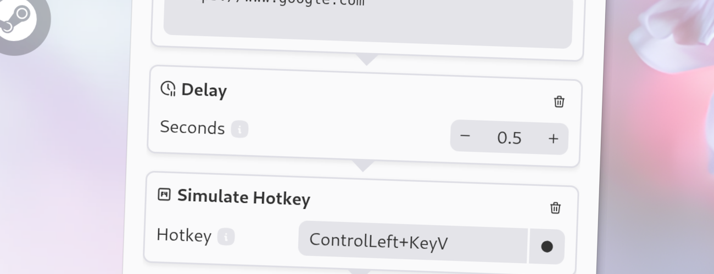

import Intro from '../../../components/Intro.astro';
import { Icon } from 'astro-icon/components';



<Intro>
This action pauses the workflow execution for a specified amount of time.
</Intro>

This action is often used to introduce a pause between actions in a workflow, allowing for timed delays or waiting for certain conditions to be met.

## <Icon name="solar:check-circle-bold-duotone" class="inline-icon" /> Options

This action has the following options:

* **Duration**: The duration of the delay in seconds. You can use decimal values to specify a delay of less than one second.

## <Icon name="solar:settings-bold-duotone" class="inline-icon" /> JSON Configuration

If you edit your [`menus.json`](/config-files) file by hand or use the [IPC interface](/ipc-interface), you can create this action with something like the following.

```json title="menus.json" {5-8}
...
"selectWorkflow": {
  "actions": [
    ...
    {
      "type": "delay",
      "duration": 0.5
    }
    ...
  ]
}
...
```