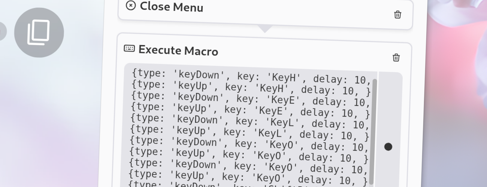

import Intro from '../../../components/Intro.astro';
import { Icon } from 'astro-icon/components';
import { Tabs, TabItem, Steps, Aside } from '@astrojs/starlight/components';



<Intro>
You can use this action to automate tasks that require multiple keyboard shortcuts or key presses in sequence.
</Intro>

You can use the menu editor to record a complete macro and edit the recorded events if needed.
It is perfectly fine to edit the recorded macro to fine-tune it or to add delays between key presses if needed.

<Aside type="tip">
See [Valid Key Names](/valid-keynames) for details on the format of the keys.
</Aside>

## <Icon name="solar:check-circle-bold-duotone" class="inline-icon" /> Options

The action does not have any options besides the macro itself, which is a list of key events that will be executed in order.

## <Icon name="solar:settings-bold-duotone" class="inline-icon" /> Example Configuration

If you edit your [`menus.json`](/config-files) file by hand or use the [IPC interface](/ipc-interface), you can create this action with something like the following.
This action will type "Hi" on most keyboard layouts:

```json title="menus.json" {5-39}
...
"selectWorkflow": {
  "actions": [
    ...
    {
      "type": "execute-macro",
      "macro": [
        {
          "type": "keyDown",
          "key": "ShiftLeft",
          "delay": 10
        },
        {
          "type": "keyDown",
          "key": "KeyH",
          "delay": 10
        },
        {
          "type": "keyUp",
          "key": "KeyH",
          "delay": 10
        },
        {
          "type": "keyUp",
          "key": "ShiftLeft",
          "delay": 10
        },
        {
          "type": "keyDown",
          "key": "KeyI",
          "delay": 10
        },
        {
          "type": "keyUp",
          "key": "KeyI",
          "delay": 10
        }
      ],
    },
    ...
  ]
}
...
```