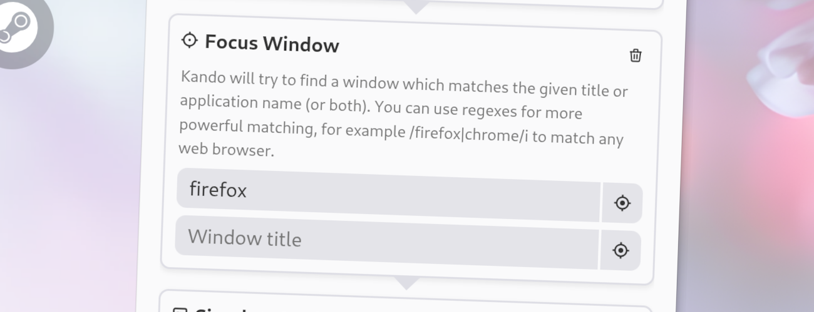
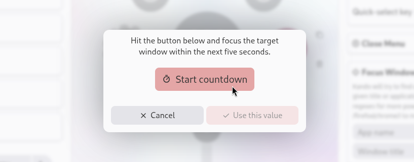

import Intro from '../../../components/Intro.astro';
import { Icon } from 'astro-icon/components';
import { Aside } from '@astrojs/starlight/components';



<Intro>
This action focuses a specific window. This allows you to switch to another window during a workflow.
</Intro>

## <Icon name="solar:check-circle-bold-duotone" class="inline-icon" /> Options

This action has the following options. You can define the window to focus by its name or by the name of the application it belongs to. If you specify both, the window must match both criteria to be focused.

* **Application Name**: The name of the application to focus. If an application has multiple windows, and you do not specify a window name, the most recently used window of the application will usually be focused. You can use [regular expressions](https://regexone.com/) if you want to use more complex patterns to match the application name.
* **Window Name**: The name of the window to focus. This is the text usually displayed in the title bar of the window. You can provide a partial name, so you don't have to specify the exact name of the window. Also, this supports [regular expressions](https://regexone.com/) if you want to use more complex patterns to match the window name.

### Use the Window Picker

You do not have to manually find out the name of the window or application you want to focus.
Kando comes with a **window picker** which allows you to select one of your open windows and automatically fills in the window or application name for you.
Just click on the "Pick Window" button next to the options in the menu editor.


<center><sup>The window picker allows you to select one of your open windows.</sup></center>

## <Icon name="solar:settings-bold-duotone" class="inline-icon" /> JSON Configuration

If you edit your [`menus.json`](/config-files) file by hand or use the [IPC interface](/ipc-interface), you can create this action with something like the following.

```json title="menus.json" {5-9}
...
"selectWorkflow": {
  "actions": [
    ...
    {
      "type": "focus-window",
      "windowName": "",
      "appName": "firefox"
    }
    ...
  ]
}
...
```