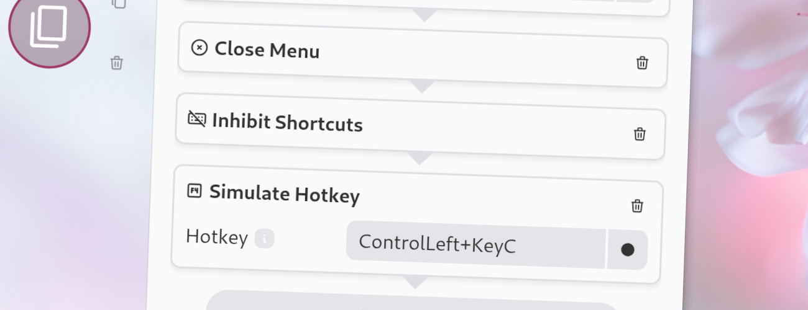

import Intro from '../../../components/Intro.astro';
import { Icon } from 'astro-icon/components';
import { Aside } from '@astrojs/starlight/components';



<Intro>
This action inhibits Kando's keyboard shortcuts. This means, any keyboard shortcuts defined in Kando will be disabled for the remainder of the workflow run.
</Intro>

If, for example, you have bound the global shortcut <kbd>Ctrl</kbd>+<kbd>C</kbd> to open a menu, you will not be able to copy selected text by simulating <kbd>Ctrl</kbd>+<kbd>C</kbd> with a Simulate-Shortcut action, as this would just open the menu again.
By placing the Inhibit-Shortcuts action before the Simulate-Shortcut action, you can ensure that the simulated shortcut will actually copy the selected text instead of opening the menu again.

<Aside type="caution">
This action is not fully supported on all platforms as some can not disable global shortcuts without user interaction. This is for instance the case on **KDE Wayland**. On such platforms, this action will only prevent the shortcuts from triggering menus, but they will still be intercepted by the operating system and not passed to the currently focused application.
</Aside>

## <Icon name="solar:check-circle-bold-duotone" class="inline-icon" /> Options

This action has no options.

## <Icon name="solar:settings-bold-duotone" class="inline-icon" /> JSON Configuration

If you edit your [`menus.json`](/config-files) file by hand or use the [IPC interface](/ipc-interface), you can create this action with something like the following.

```json title="menus.json" {5-7}
...
"selectWorkflow": {
  "actions": [
    ...
    {
      "type": "inhibit-shortcuts"
    }
    ...
  ]
}
...
```