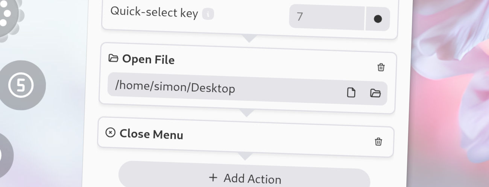

import Intro from '../../../components/Intro.astro';
import { Icon } from 'astro-icon/components';



<Intro>
With this action, you can open a file or directory.
While you could also use the "Run Command" or "Open URI" item types for this, the "Open File" action provides file pickers for both files and directories.
</Intro>


## <Icon name="solar:check-circle-bold-duotone" class="inline-icon" /> Options

This action has the following options. 
* **Path**: The path of the file or directory to open. The file or directory will be opened with the default application for it. You can click on the "Pick File" or "Pick Directory" button next to the option in the menu editor to open a file or directory picker.

## <Icon name="solar:settings-bold-duotone" class="inline-icon" /> JSON Configuration

If you edit your [`menus.json`](/config-files) file by hand or use the [IPC interface](/ipc-interface), you can create this action with something like the following.

```json title="menus.json" {5-8}
...
"selectWorkflow": {
  "actions": [
    ...
    {
      "type": "open-file",
      "path": "/home/simon/Desktop"
    }
    ...
  ]
}
...
```