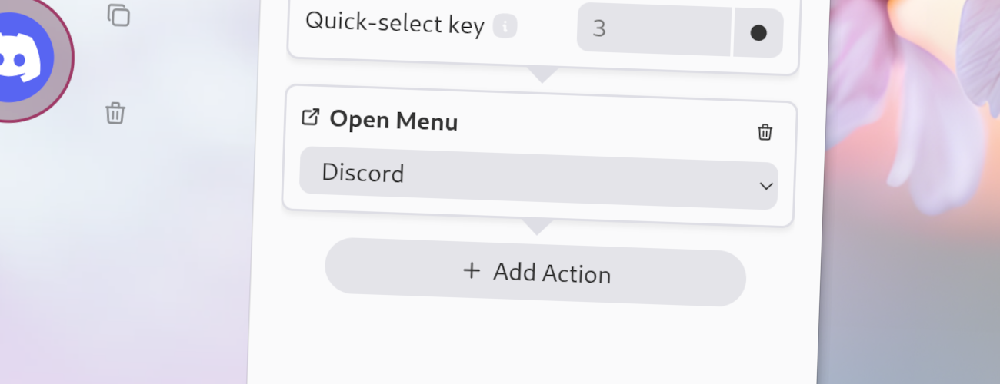

import Intro from '../../../components/Intro.astro';
import { Icon } from 'astro-icon/components';
import { Aside } from '@astrojs/starlight/components';



<Intro>
This action will immediately open another menu when executed. 
</Intro>

<Aside type="caution">
You should not place a Close-Menu action after this action in the same workflow, as this would just close the menu again immediately after opening it.
</Aside>

## <Icon name="solar:check-circle-bold-duotone" class="inline-icon" /> Options

This action has the following options:

* **Menu**: The name of the menu to open when this action is executed. If multiple menus have the same name, the first one will be opened.

## <Icon name="solar:settings-bold-duotone" class="inline-icon" /> JSON Configuration

If you edit your [`menus.json`](/config-files) file by hand or use the [IPC interface](/ipc-interface), you can create this action with something like the following.

```json title="menus.json" {5-8}
...
"selectWorkflow": {
  "actions": [
    ...
    {
      "type": "open-menu",
      "menu": "Discord"
    }
    ...
  ]
}
...
```