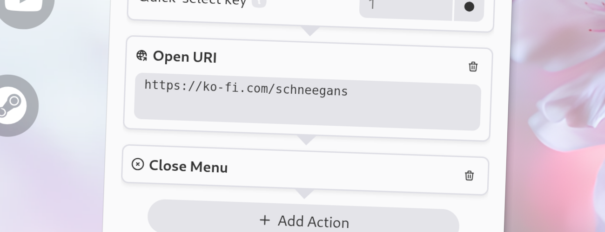

import Intro from '../../../components/Intro.astro';
import { Icon } from 'astro-icon/components';



<Intro>
An URI item can not only be used to open a website but also to open any URI that your operating system can handle.
This includes opening files, directories, or even other applications.
</Intro>

## <Icon name="solar:check-circle-bold-duotone" class="inline-icon" /> Options

This action has the following options. 
* **URI**: The URI to open. This can be a website, a file, a directory, or any other URI that your operating system can handle.

## <Icon name="solar:globus-bold-duotone" class="inline-icon" /> Example URIs

Here are some examples of URIs that you can use with the Open-URI item:

- **http://example.com** - Opens the website `example.com` in your default browser.
- **file:///path/to/file.txt** - Opens the file `file.txt` in your default text editor.
- **mailto:foo@bar.com** - Opens your default email client to send an email.

## <Icon name="solar:code-line-duotone" class="inline-icon" /> Placeholders

You can use placeholders in the URI which will be replaced by some actual values when the URI is opened.
This allows for some very advanced use-cases!
Below are the available placeholders:

- `{{app_name}}`: The name of the application which was focused when the menu was opened.
- `{{window_name}}`: The title of the window which was focused when the menu was opened.
- `{{pointer_x}}`: The x-coordinate of the mouse pointer when the menu was opened.
- `{{pointer_y}}`: The y-coordinate of the mouse pointer when the menu was opened.

## <Icon name="solar:settings-bold-duotone" class="inline-icon" /> JSON Configuration

If you edit your [`menus.json`](/config-files) file by hand or use the [IPC interface](/ipc-interface), you can create this action with something like the following.

```json title="menus.json" {5-8}
...
"selectWorkflow": {
  "actions": [
    ...
    {
      "type": "open-uri",
      "uri": "https://ko-fi.com/schneegans"
    }
    ...
  ]
}
...
```