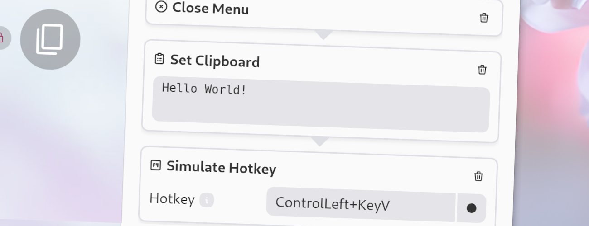

import Intro from '../../../components/Intro.astro';
import { Icon } from 'astro-icon/components';



<Intro>
With this action, you can set the clipboard content.
This is useful if you want want to paste some predefined text somewhere else.
</Intro>


## <Icon name="solar:check-circle-bold-duotone" class="inline-icon" /> Options

This action has the following options. 
* **Text**: The text to set in the clipboard.

## <Icon name="solar:settings-bold-duotone" class="inline-icon" /> JSON Configuration

If you edit your [`menus.json`](/config-files) file by hand or use the [IPC interface](/ipc-interface), you can create this action with something like the following.

```json title="menus.json" {5-8}
...
"selectWorkflow": {
  "actions": [
    ...
    {
      "type": "set-clipboard",
      "text": "Hello World!"
    }
    ...
  ]
}
...
```