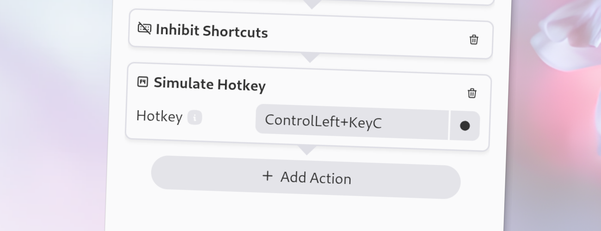

import Intro from '../../../components/Intro.astro';
import { Icon } from 'astro-icon/components';
import { Aside } from '@astrojs/starlight/components';



<Intro>
This type is used to simulate simple keyboard events.
You can use this to trigger shortcuts in other applications to automate tasks.
</Intro>


## <Icon name="solar:check-circle-bold-duotone" class="inline-icon" /> Options

This action has the following options. 
* **Hotkey**: The hotkey to simulate. You can either record the hotkey by clicking on the "Record Hotkey" button and pressing the desired hotkey, or you can directly type the hotkey into the field. The latter is useful if you want to use a hotkey that is either not available on your keyboard or is globally bound to another application.

  You can also type the keys one after another: If you want to simulate <kbd>Alt</kbd> + <kbd>F4</kbd>, you can press <kbd>Alt</kbd> first, release it, then press <kbd>F4</kbd>.
Else this would close the Kando window!

<Aside type="tip">
See [Valid Key Names](/valid-keynames) for details on the format of the hotkey.
</Aside>


## <Icon name="solar:settings-bold-duotone" class="inline-icon" /> JSON Configuration

If you edit your [`menus.json`](/config-files) file by hand or use the [IPC interface](/ipc-interface), you can create this action with something like the following.

```json title="menus.json" {5-8}
...
"selectWorkflow": {
  "actions": [
    ...
    {
      "type": "simulate-hotkey",
      "hotkey": "ControlLeft+C"
    }
    ...
  ]
}
...
```