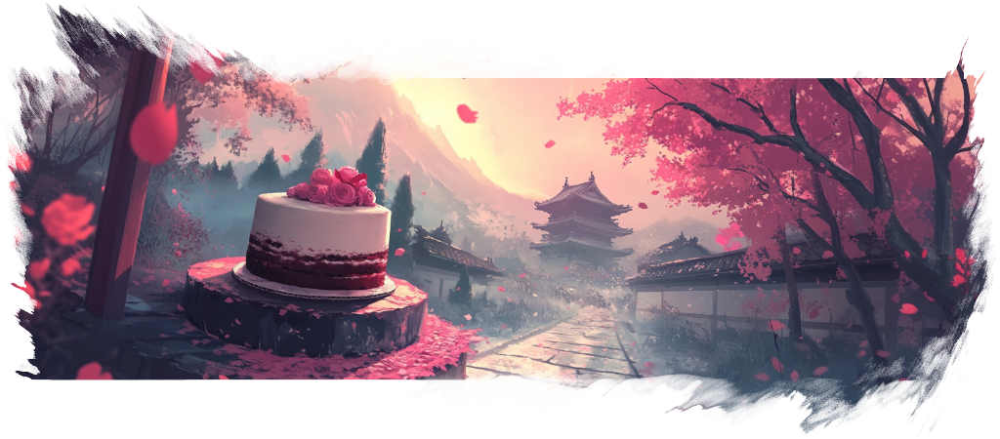

import { Aside, LinkCard } from '@astrojs/starlight/components';
import Intro from '../../components/Intro.astro';
import { Icon } from 'astro-icon/components';
import {Image} from 'astro:assets';

import editor from '../../assets/img/editor.png';

<Intro>
Kando comes with an example menu which you can use to get started.
However, you should soon adapt the menu to your needs and create your own menus.
</Intro>

## <Icon name="solar:settings-bold-duotone" class="inline-icon" /> The Menu Editor

Kando comes with a **graphical menu editor** which allows you to create and edit your own menus.
There are four ways to open the menu editor:

1. **Click the gear icon** in the bottom right corner of the screen when a menu is shown.
2. **Press <kbd>Ctrl / Command</kbd> + <kbd>,</kbd>** when a menu is shown.
2. **Right-click the Kando tray icon** and select "Show Settings".
3. **Run `kando --settings`** from the command line.

In the editor, you can create new menus, and edit existing menus.
Drag new items from the toolbar to the menu preview, reorder them, and change their properties on the right side of the screen.

<Image src={editor} alt="menu editor" class="shadow"/>

If you open the menu editor for the first time, it will look like this.

You can compose your menus from a variety of item types.
Below you can find a list of all currently available item types.
Click on an item to learn more about it!

<LinkCard title="Submenu" description='Use this to create nested menus.' href="/item-submenu"/>
<LinkCard title="Run Command" description='Can be used to open applications or run shell commands.' href="/item-run-command"/>
<LinkCard title="Open File" description='Can be used to open files, websites, and more.' href="/item-file"/>
<LinkCard title="Simulate Hotkey" description='Simulates a simple keyboard shortcut.' href="/item-simulate-hotkey"/>
<LinkCard title="Execute Macro" description='Simulates a complex sequence of keyboard shortcuts.' href="/item-execute-macro"/>
<LinkCard title="Paste Text" description='Paste a given text into the focused application.' href="/item-paste-text"/>
<LinkCard title="Open URI" description='Use this to open files, websites, and more.' href="/item-open-uri"/>
<LinkCard title="Redirect to another Menu" description='Use this as a link to another menu.' href="/item-redirect"/>
<LinkCard title="Open Settings" description="Opens Kando's settings dialog." href="/item-settings"/>

## <Icon name="solar:lightbulb-minimalistic-bold-duotone" class="inline-icon" /> Tips for Efficient Menu Layouts

Just like with any other user interface, the layout of your menus is crucial for a good user experience.
Here are some tips to help you create efficient and user-friendly menus!

### Avoid too many items in a single menu!

Instead, create submenus. Eight items per menu is a good rule of thumb, and you should never have more than twelve items in a single menu.
Else, the menu will become too cluttered and hard to navigate.

### Deeply nested menus are not a problem!

Kando is designed to handle deeply nested menus well.
Prefer depth over width!
Selecting items nested in submenus is easy and fast.
You can use the marking mode to quickly select items which are in subsubsubmenus.

### Use the fixed-angle locks to create a clean layout!

Even if you have an odd number of items, you can use fixed angles to lock items to the top, bottom, left, or right side of the menu.
This way, you can control the shape of the gesture you have to draw to select an item.
Try to create easy-to-remember gestures!

