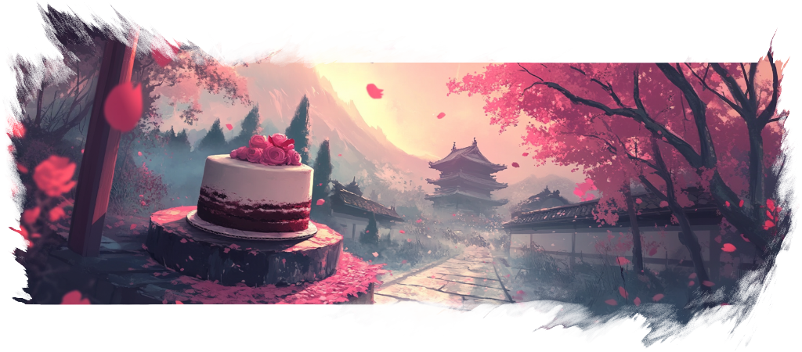
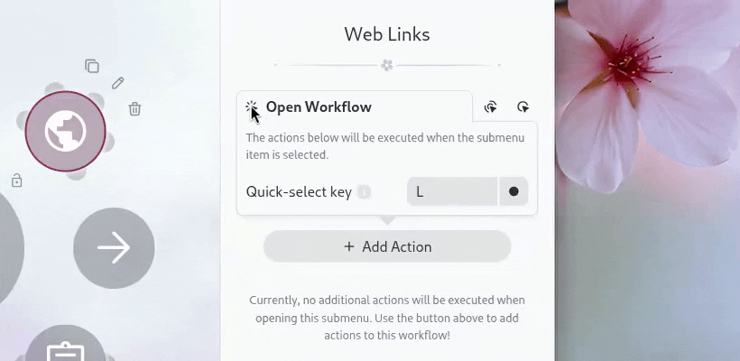
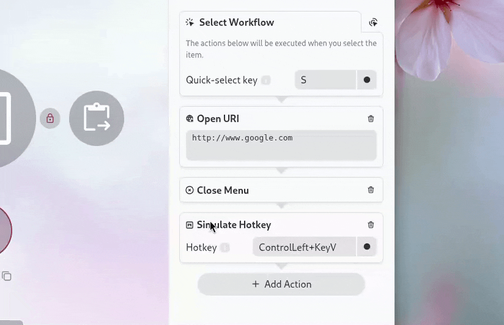
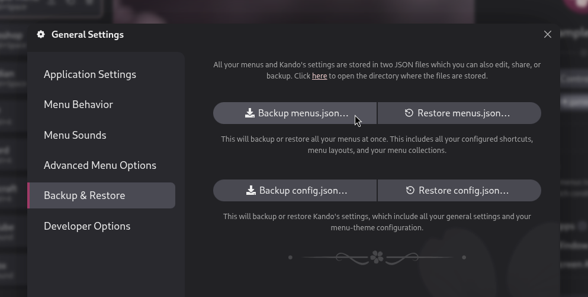

import { Aside, LinkCard } from '@astrojs/starlight/components';
import Intro from '../../components/Intro.astro';
import ThemeImage from '../../components/ThemeImage.astro';
import { Icon } from 'astro-icon/components';
import {Image} from 'astro:assets';

import editorLight from '../../assets/editor-screen-light.png';
import editorDark from '../../assets/editor-screen-dark.png';

<Intro>
Kando comes with an example menu which you can use to get started.
However, you should soon adapt the menu to your needs and create your own menus.
</Intro>

## <Icon name="solar:settings-bold-duotone" class="inline-icon" /> The Menu Editor

Kando comes with a **graphical menu editor** which allows you to create and edit your own menus.
There are four ways to open the menu editor:

1. **Click the gear icon** in the bottom right corner of the screen when a menu is shown.
2. **Press <kbd>Ctrl / Command</kbd> + <kbd>,</kbd>** when a menu is shown.
2. **Right-click the Kando tray icon** and select "Show Settings".
3. **Run `kando --settings`** from the command line.

In the editor, you can create new menus, and edit existing menus.
Drag new items from the toolbar to the menu preview, reorder them, and change their properties on the right side of the screen.

<ThemeImage lightSrc={editorLight} darkSrc={editorDark} alt="menu editor" class="shadow" />

Once you configured some menus, the editor may look like this.

### Organizing Menus

In Kando, you can create any number of menus.
All your menus are shown in the **menu list on the left** side of the editor.
Here you can add new menus, reorder your menus, group them in collections by using tags, and more.

With a menu selected, you can edit its properties in the **menu properties panel on the right** side of the editor.
Here you can change the menu's name, icon, and more.

### Adding Menu Items

To each menu, you can add any number of **menu items**.
A menu item is a single entry in the menu which can either be a submenu or a so called "button item".
New menu items can be added by dragging them from the toolbar at the bottom of the menu preview to the desired position in the menu.

The first menu item type in the toolbar is the **submenu item**.
All other item types are **button items** with some predefined example workflows.

### Creating Workflows

Each menu item offers several workflows which are executed when certain events happen, e.g. when the item is selected.
You can edit these workflows by clicking on the corresponding tabs in the item properties panel on the right side of the editor.

For instance, **submenu items** have a "Open Workflow" (which is executed when you select the submenu), a "Hover Workflow" (which is executed when you hover over the submenu before selecting it), and a "Center-Click Workflow" (which is executed when you click the center of the submenu when it is open).

**Button items** have only two workflows: a "Select Workflow" and a "Hover Workflow".
Now you can add any number of actions to these workflows, and compose complex sequences of actions which are executed when you select or hover over the item.

You can reorder the actions in a workflow by dragging and dropping them in the workflow editor.

You can compose your workflows from a variety of action types.
Below you can find a list of the most commonly used actions.
For a list of all available action types, checkout **Available Actions** in the navigation on the left.

<LinkCard title="Execute Command" description='Can be used to open applications or run shell commands.' href="/actions/execute-command"/>
<LinkCard title="Open File" description='Can be used to open files, websites, and more.' href="/actions/open-file"/>
<LinkCard title="Simulate Hotkey" description='Simulates a simple keyboard shortcut.' href="/actions/simulate-hotkey"/>
<LinkCard title="Execute Macro" description='Simulates a complex sequence of keyboard shortcuts.' href="/actions/execute-macro"/>
<LinkCard title="Open URI" description='Use this to open files, websites, and more.' href="/actions/open-uri"/>
<LinkCard title="Focus Window" description="Switches focus to a specific window." href="/actions/focus-window"/>

## <Icon name="solar:safe-2-bold-duotone" class="inline-icon" /> Backup your Menus and Settings!

It's a good idea to backup your menus and settings regularly, especially if you have spent a lot of time customizing them.
All of Kando's settings, including your menus, are stored in [two JSON files](/config-files).
You can either backup these files manually, or use the corresponding buttons in the general settings dialog.

## <Icon name="solar:lightbulb-minimalistic-bold-duotone" class="inline-icon" /> Tips for Efficient Menu Layouts

Just like with any other user interface, the layout of your menus is crucial for a good user experience.
Here are some tips to help you create efficient and user-friendly menus!

### Avoid too many items in a single menu!

Instead, create submenus. Eight items per menu is a good rule of thumb, and you should never have more than twelve items in a single menu.
Else, the menu will become too cluttered and hard to navigate.

### Deeply nested menus are not a problem!

Kando is designed to handle deeply nested menus well.
Prefer depth over width!
Selecting items nested in submenus is easy and fast.
You can use the marking mode to quickly select items which are in subsubsubmenus.

### Use the fixed-angle locks to create a clean layout!

Even if you have an odd number of items, you can use fixed angles to lock items to the top, bottom, left, or right side of the menu.
This way, you can control the shape of the gesture you have to draw to select an item.
Try to create easy-to-remember gestures!

