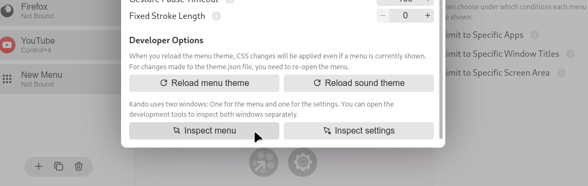
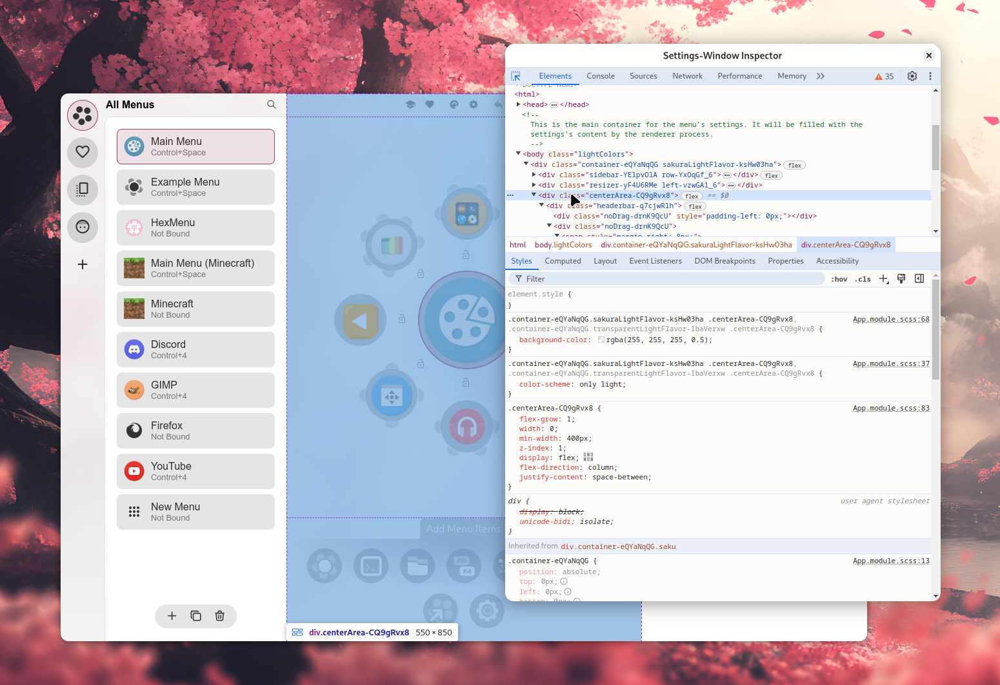
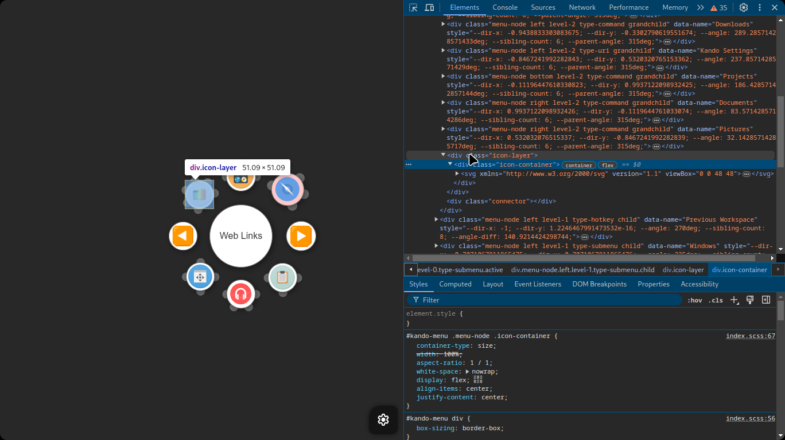

import { Aside } from '@astrojs/starlight/components';
import Intro from '../../components/Intro.astro';
import {Image} from 'astro:assets';
import { Icon } from 'astro-icon/components';

import vscodeDebugging from '../../assets/img/debugging.png';
import performanceProfile from '../../assets/img/performance-profile.png';


<Intro>
At some point, `console.log(...)` statements are not enough anymore. At some point, you will want to use a 🐛 debugger, 💡 inspect Kando's UI, or 🚀 profile its performance.
</Intro>

## <Icon name="solar:bug-bold-duotone" class="inline-icon" /> Using a Debugger

Debugging an Electron application is not exactly straightforward.
This is because Electron applications consist of **two parts: the main process and the renderer processes**.

The **main process** is responsible for managing the application lifecycle and has access to the operating system.
The **renderer processes** are responsible for rendering the user interface and are more or less isolated from the operating system.
Kando has one main process and two renderer processes: one for the menu and one for the settings dialog.

### Debugging in VSCode

If you are using [Visual Studio Code](https://code.visualstudio.com/), you can set up debugging by creating a `.vscode/launch.json` file in your project directory.
Put the following content into that file:

```json5 title=".vscode/launch.json"
{
  "configurations": [
    {
      "type": "node",
      "request": "launch",
      "name": "Kando: Main Process",
      "runtimeExecutable": "${workspaceRoot}/node_modules/.bin/tsx",
      "runtimeArgs": [
        "node_modules/@electron-forge/cli/src/electron-forge-start",
        "--",
        "--remote-debugging-port=9223"
      ],
      "autoAttachChildProcesses": true,
      "internalConsoleOptions": "openOnFirstSessionStart",
      "console": "integratedTerminal"
    },
    {
      "name": "Kando: Renderer Processes",
      "type": "chrome",
      "request": "attach",
      "port": 9223,
      "webRoot": "${workspaceFolder}",
      "timeout": 100000
    }
  ],
  "compounds": [
    {
      "name": "Kando: All",
      "configurations": ["Kando: Main Process", "Kando: Renderer Processes"]
    }
  ]
}
```

<Aside type="note" title="Not Working?">
If the port `9223` is already in use or not working for some reason, you can change it to another port like `12345`.
Just make sure to change it in both configurations.
</Aside>

Once this is in place, you can start debugging Kando by selecting the "Kando: All" configuration in the debug panel and clicking the green play button.
This will start the main process and attach the debugger to both the main process and the renderer processes.
You can then set breakpoints in your code and inspect variables!

<center>
<Image src={vscodeDebugging} alt="debugging in VSCode" class="shadow"/>
</center>
<center>
<sup>Render process debugging in VSCode!</sup>
</center>

### Other IDEs

Have you successfully set up debugging in another IDE?
Let us know by editing this page!
You can also join our [Discord server](https://discord.gg/hZwbVSDkhy) and discuss it there.

## <Icon name="solar:rocket-bold-duotone" class="inline-icon" /> Using the DevTools

Kando comes with built-in development tools that you can use to inspect the user interface and debug your code.
You can open the DevTools from the General Settings dialog.
Here, you can choose between inspecting the menu itself or the settings dialog.



### Inspecting the Settings and the Menu

The DevTools for the settings dialog will open in a separate window.
You can use this to inspect the HTML and CSS of the settings dialog, and to test temporary changes.
Especially for understanding the layout of the components, this is very useful.



The DevTools for the menu will open embedded in the menu window.
This is useful, as otherwise the menu window would obscure the DevTools.

To open the DevTools, click the "Inspect Menu" button in the General Settings dialog and then open a menu.
The menu window will not be transparent anymore, due to a quirk in Electron.



### Profiling the Rendering Performance

A good rendering performance is important for the settings dialog but it is crucial for the menu.
Hence, when implementing new features, we should always keep an eye on the performance.

The development tools allow you to capture a performance profile of the menu or the settings dialog.
To do this, open the DevTools and switch to the "Performance" tab.
Then, click the "Record" button and interact with the menu or the settings dialog.
Once you are done, click the "Stop" button to stop the recording.

Now you explore the recorded profile frame by frame.
You can see how long each frame took to render and which functions were called during that frame.
This is extremely useful to identify performance bottlenecks in your code.

<center>
<Image src={performanceProfile} alt="profiling in the dev tools" class="shadow"/>
</center>

<Aside type="tip" title="Need Help?">
If you encounter a problem at any stage, feel free to ask for help in the **#support** or **#dev-chat** channel on [Kando's Discord Server](https://discord.gg/hZwbVSDkhy)!
</Aside>