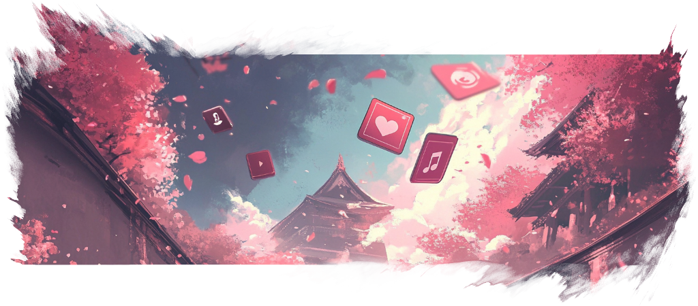
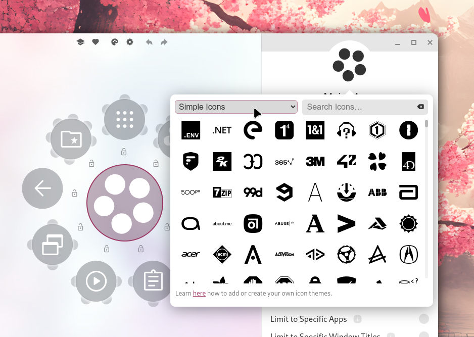

import { CardGrid, Aside, Tabs, TabItem, Steps, Badge, FileTree } from '@astrojs/starlight/components';
import CustomCard from '../../components/CustomCard.astro';
import Intro from '../../components/Intro.astro';
import { Icon } from 'astro-icon/components';



<Intro>
An icon theme is a set of icons which can be used for the menu items.
Kando comes with a few icon themes pre-installed and you can easily add your own.
</Intro>

## <Icon name="solar:backpack-bold-duotone" class="inline-icon" /> Built-in Icon Themes

Kando comes with a few icon themes pre-installed. You can select them in the icon picker in the menu editor.

1. [Simple Icons](https://simpleicons.org) (Plain & Colored): A set of icons for popular brands.
2. [Material Symbols Rounded](https://fonts.google.com/icons): An icon set for common actions and objects.
3. Emojis: This allows you to use any emoji as an icon.
4. Kando's own icons: Kando comes with a few icons which are used per default for new menu items.

## <Icon name="solar:gallery-minimalistic-bold-duotone" class="inline-icon" /> Adding Your Own Icon Theme

To add your own icons to Kando, follow these steps:

<Steps>

1. Create a directory for your icon theme inside the `icon-themes` directory. You can give it any name you like. Where this directory is located depends on your operating system:

    <Tabs syncKey="os">
      <TabItem label="Windows" icon="seti:windows">
        ```cmd
        %appdata%\kando\
        ```
      </TabItem>
      <TabItem label="macOS" icon="apple">
        ```bash
        ~/Library/Application Support/kando/
        ```
      </TabItem>
      <TabItem label="Linux" icon="linux">
        ```bash
        ~/.config/kando/
        ```
      </TabItem>
      <TabItem label="Flatpak" icon="linux">
        ```
        ~/.var/app/menu.kando.Kando/config/kando/
        ```
      </TabItem>
    </Tabs>

    <FileTree>
    - kando
      - icon-themes/ Put your theme folder in here.
        - some-icon-theme/ The name will be shown in the icon picker.
          - icon1.svg
          - icon2.svg
          - ...
      - menu-themes/ 
      - sound-themes/ 
      - config.json
      - menus.json
    </FileTree>

2. Add your icons to the new directory. The icons can be in various formats, but we recommend using SVG files.

    <Aside type="tip">
      You can organize your icons in subdirectories. Kando will load them recursively.
    </Aside>

3. **Restart Kando.** Icon themes are only loaded when Kando starts.

4. Select your icon theme in the icon-theme dropdown in the icon picker in Kando's menu editor.

     

</Steps>

## <Icon name="solar:lightbulb-minimalistic-bold-duotone" class="inline-icon" /> Suggestions for Icon Sets

There are many great icon sets available on the internet. Here are some which you could try:
* [Numix Circle](https://github.com/numixproject/numix-icon-theme-circle): Just use the files from the `Numix-Circle/48/apps` directory.
* [Papirus](https://github.com/PapirusDevelopmentTeam/papirus-icon-theme): Here you could use the content from the `Papirus/64x64` directory.
* [Tela](https://github.com/vinceliuice/Tela-icon-theme): Here you find the icons in the `src/scalable` directory.
* [Pixelitos](https://github.com/ItzSelenux/pixelitos-icon-theme): Here you find the icons in the `16` directory.

<br/>
<br/>

<Aside type="note" title="Have you discovered another cool icon set?">
Simply edit this page and add it to the list above!
</Aside>


