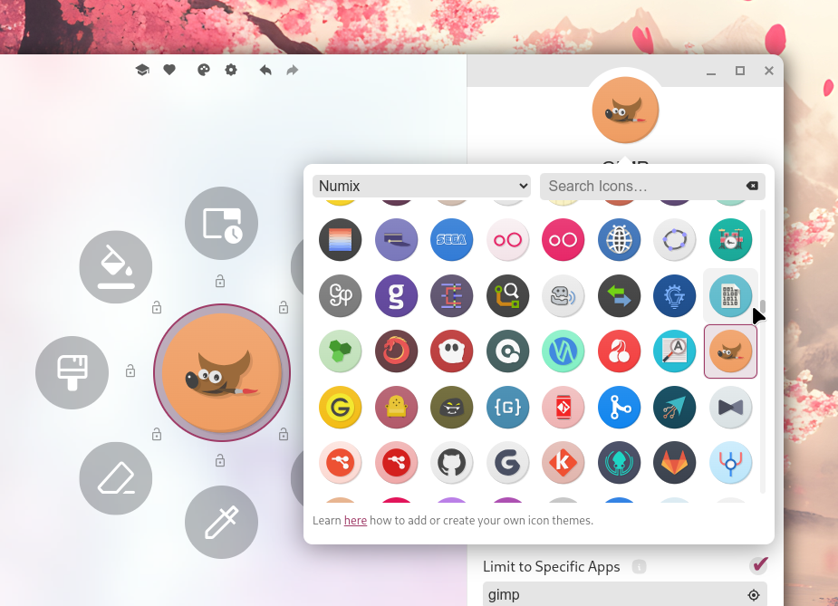

import { CardGrid, Aside, Tabs, TabItem, Steps, Badge, FileTree } from '@astrojs/starlight/components';
import CustomCard from '../../components/CustomCard.astro';
import Intro from '../../components/Intro.astro';
import { Icon } from 'astro-icon/components';

import exampleSVGFixed from '../../assets/img/example-svg-fill-red.svg?raw';
import exampleSVGCurrent from '../../assets/img/example-svg-current.svg?raw';
import exampleSVGMixed from '../../assets/img/example-svg-mixed.svg?raw';


<Intro>
An icon theme is a set of icons which can be used for the menu items.
Kando comes with a few icon themes pre-installed and you can easily add your own.
</Intro>

## <Icon name="solar:backpack-bold-duotone" class="inline-icon" /> Built-in Icon Themes

 

Kando comes with a few icon themes pre-installed. You can select them in the icon picker in the menu editor.
Here's a list of the built-in icon themes:

1. System Icons <Badge text="soon!" variant="tip" />: This special icon theme contains different icons depending on your operating system.
   * On **Windows** and **macOS**, it contains the icons of the applications you have installed.
   * On **Linux**, it contains the icons of the currently selected icon theme of your desktop environment. This means, the icons will change when you change your desktop environment's icon theme!
2. [Simple Icons](https://simpleicons.org) (Plain & Colored): A set of icons for popular brands.
3. [Material Symbols Rounded](https://fonts.google.com/icons): An icon set for common actions and objects.
4. Base64 / URL: This allows you to use any icon from the web or your local file system by providing a Base64-encoded string or a URL.
5. Emojis: This allows you to use any emoji as an icon.
6. Kando's own icons: Kando comes with a few icons which are used per default for new menu items.

The Simple Icons, the Material Symbols, and Kando's own icons are set up in such a way that they will change their color automatically based on the used menu theme.
You can learn how to make your own icons behave like this further below!

## <Icon name="solar:gallery-minimalistic-bold-duotone" class="inline-icon" /> Adding Your Own Icon Theme

To add your own icons to Kando, follow these steps:

<Steps>

1. **Create an icon-theme directory** for your icon theme inside the `icon-themes` directory. You can give it any name you like. Where this directory is located depends on your operating system:

    <Tabs syncKey="os">
      <TabItem label="Windows" icon="seti:windows">
        ```cmd
        %appdata%\kando\
        ```
      </TabItem>
      <TabItem label="macOS" icon="apple">
        ```bash
        ~/Library/Application Support/kando/
        ```
      </TabItem>
      <TabItem label="Linux" icon="linux">
        ```bash
        ~/.config/kando/
        ```
      </TabItem>
      <TabItem label="Flatpak" icon="linux">
        ```
        ~/.var/app/menu.kando.Kando/config/kando/
        ```
      </TabItem>
    </Tabs>

    <FileTree>
    - kando
      - icon-themes/ Put your theme folder in here.
        - some-icon-theme/ The name will be shown in the icon picker.
          - icon1.svg
          - icon2.svg
          - ...
      - menu-themes/ 
      - sound-themes/ 
      - config.json
      - menus.json
    </FileTree>

2. Add your icons to the new directory. The icons can be in various formats, but we recommend using SVG files.

    <Aside type="tip">
      You can organize your icons in subdirectories. Kando will load them recursively.
    </Aside>

3. **Restart Kando.** Icon themes are only loaded when Kando starts.

4. Select your icon theme in the icon-theme dropdown in the icon picker in Kando's menu editor.

     

</Steps>

### Make Icon-Colors Adaptive

<Aside type="note">
Your icons need to be SVG files for this to work because this relies on the [`currentColor`](https://echobind.com/post/currentcolor-css-property-with-svg) SVG-feature.
Recoloring icons will not work with PNG or other raster formats.
</Aside>

Per default, SVG icons will be displayed in their original color.
However, especially for monochrome icons, it is often desirable to change the color of the icons based on the menu theme.

The basic idea is to set the `fill` or `stroke` attributes of the shapes in your SVG files to `currentColor`.
Usually, SVG files have a fixed color set for these (like `fill="red"`  or `stroke="#ff6677"`), however, the special variable `currentColor` can be used instead.

**This means, you will need to edit your SVG files and change the `fill` attribute of the shapes to `currentColor`.**
Here are some examples, the corresponding SVG code is shown in the tabs below the images.

Image | Name | Explanation
--- | --- | ---
<div style="position: absolute"><Fragment set:html={exampleSVGFixed} /></div> |  red.svg | This is how most SVG files will look like by default. The `fill` attribute is set to a fixed color (in this case, red). This means the icon will always be red, regardless of the menu theme. You can change the color theme of this website to see that the icon does not change its color.
<div style="position: absolute"><Fragment set:html={exampleSVGCurrent} /></div> | current.svg | If you use `currentColor` as the value for the `fill` attribute, the icon will ba adaptive! **Try changing the color theme of this website!** The icon will switch between light and dark colors automatically.
<div style="position: absolute"><Fragment set:html={exampleSVGMixed} /></div> | mixed.svg | You can also mix adaptive and fixed colors in your SVG files. In this example, the fill color will adapt to the menu theme, while the stroke color will always be red.

<Tabs>
  <TabItem label="red.svg">
   ```xml {7}
    <?xml version="1.0" encoding="UTF-8" standalone="no"?>
    <svg
      width="150" height="150" viewBox="0 0 256 256" version="1.1"
      xmlns="http://www.w3.org/2000/svg" xmlns:svg="http://www.w3.org/2000/svg">
      <g>
        <path
          style="fill:red"
          d="M 93.175781 21.878906 A 37.714935 37.714935 0 0 0 56.533203 48.351562 A 37.714935 37.714935 0 0 0 81.296875 95.589844 A 37.714935 37.714935 0 0 0 128.53711 70.826172 A 37.714935 37.714935 0 0 0 103.77344 23.585938 A 37.714935 37.714935 0 0 0 93.175781 21.878906 z M 182.66016 35.625 A 37.714935 37.714935 0 0 0 144.94531 73.339844 A 37.714935 37.714935 0 0 0 182.66016 111.05469 A 37.714935 37.714935 0 0 0 220.375 73.339844 A 37.714935 37.714935 0 0 0 182.66016 35.625 z M 54.578125 101.62695 A 37.714935 37.714935 0 0 0 21.8125 116.89844 A 37.714935 37.714935 0 0 0 29.8125 169.63281 A 37.714935 37.714935 0 0 0 82.544922 161.63281 A 37.714935 37.714935 0 0 0 74.546875 108.90039 A 37.714935 37.714935 0 0 0 54.578125 101.62695 z M 195.74805 125.76172 A 37.714935 37.714935 0 0 0 185.15039 127.46875 A 37.714935 37.714935 0 0 0 160.38477 174.70703 A 37.714935 37.714935 0 0 0 207.62305 199.47266 A 37.714935 37.714935 0 0 0 232.38867 152.23438 A 37.714935 37.714935 0 0 0 195.74805 125.76172 z M 114.24609 166.14648 A 37.714935 37.714935 0 0 0 94.267578 173.38867 A 37.714935 37.714935 0 0 0 86.193359 226.11133 A 37.714935 37.714935 0 0 0 138.91602 234.18555 A 37.714935 37.714935 0 0 0 146.99023 181.46289 A 37.714935 37.714935 0 0 0 114.24609 166.14648 z "
        />
      </g>
    </svg>
    ```
  </TabItem>

  <TabItem label="current.svg">
   ```xml {7}
    <?xml version="1.0" encoding="UTF-8" standalone="no"?>
    <svg
      width="150" height="150" viewBox="0 0 256 256" version="1.1"
      xmlns="http://www.w3.org/2000/svg" xmlns:svg="http://www.w3.org/2000/svg">
      <g>
        <path
          style="fill:currentColor"
          d="M 93.175781 21.878906 A 37.714935 37.714935 0 0 0 56.533203 48.351562 A 37.714935 37.714935 0 0 0 81.296875 95.589844 A 37.714935 37.714935 0 0 0 128.53711 70.826172 A 37.714935 37.714935 0 0 0 103.77344 23.585938 A 37.714935 37.714935 0 0 0 93.175781 21.878906 z M 182.66016 35.625 A 37.714935 37.714935 0 0 0 144.94531 73.339844 A 37.714935 37.714935 0 0 0 182.66016 111.05469 A 37.714935 37.714935 0 0 0 220.375 73.339844 A 37.714935 37.714935 0 0 0 182.66016 35.625 z M 54.578125 101.62695 A 37.714935 37.714935 0 0 0 21.8125 116.89844 A 37.714935 37.714935 0 0 0 29.8125 169.63281 A 37.714935 37.714935 0 0 0 82.544922 161.63281 A 37.714935 37.714935 0 0 0 74.546875 108.90039 A 37.714935 37.714935 0 0 0 54.578125 101.62695 z M 195.74805 125.76172 A 37.714935 37.714935 0 0 0 185.15039 127.46875 A 37.714935 37.714935 0 0 0 160.38477 174.70703 A 37.714935 37.714935 0 0 0 207.62305 199.47266 A 37.714935 37.714935 0 0 0 232.38867 152.23438 A 37.714935 37.714935 0 0 0 195.74805 125.76172 z M 114.24609 166.14648 A 37.714935 37.714935 0 0 0 94.267578 173.38867 A 37.714935 37.714935 0 0 0 86.193359 226.11133 A 37.714935 37.714935 0 0 0 138.91602 234.18555 A 37.714935 37.714935 0 0 0 146.99023 181.46289 A 37.714935 37.714935 0 0 0 114.24609 166.14648 z "
        />
      </g>
    </svg>
    ```
  </TabItem>

  <TabItem label="mixed.svg">
   ```xml {7}
    <?xml version="1.0" encoding="UTF-8" standalone="no"?>
    <svg
      width="150" height="150" viewBox="0 0 256 256" version="1.1"
      xmlns="http://www.w3.org/2000/svg" xmlns:svg="http://www.w3.org/2000/svg">
      <g>
        <path
          style="fill:currentColor;stroke:red;stroke-width:10px"
          d="M 93.175781 21.878906 A 37.714935 37.714935 0 0 0 56.533203 48.351562 A 37.714935 37.714935 0 0 0 81.296875 95.589844 A 37.714935 37.714935 0 0 0 128.53711 70.826172 A 37.714935 37.714935 0 0 0 103.77344 23.585938 A 37.714935 37.714935 0 0 0 93.175781 21.878906 z M 182.66016 35.625 A 37.714935 37.714935 0 0 0 144.94531 73.339844 A 37.714935 37.714935 0 0 0 182.66016 111.05469 A 37.714935 37.714935 0 0 0 220.375 73.339844 A 37.714935 37.714935 0 0 0 182.66016 35.625 z M 54.578125 101.62695 A 37.714935 37.714935 0 0 0 21.8125 116.89844 A 37.714935 37.714935 0 0 0 29.8125 169.63281 A 37.714935 37.714935 0 0 0 82.544922 161.63281 A 37.714935 37.714935 0 0 0 74.546875 108.90039 A 37.714935 37.714935 0 0 0 54.578125 101.62695 z M 195.74805 125.76172 A 37.714935 37.714935 0 0 0 185.15039 127.46875 A 37.714935 37.714935 0 0 0 160.38477 174.70703 A 37.714935 37.714935 0 0 0 207.62305 199.47266 A 37.714935 37.714935 0 0 0 232.38867 152.23438 A 37.714935 37.714935 0 0 0 195.74805 125.76172 z M 114.24609 166.14648 A 37.714935 37.714935 0 0 0 94.267578 173.38867 A 37.714935 37.714935 0 0 0 86.193359 226.11133 A 37.714935 37.714935 0 0 0 138.91602 234.18555 A 37.714935 37.714935 0 0 0 146.99023 181.46289 A 37.714935 37.714935 0 0 0 114.24609 166.14648 z "
        />
      </g>
    </svg>
    ```
  </TabItem>
 
</Tabs>

## <Icon name="solar:lightbulb-minimalistic-bold-duotone" class="inline-icon" /> Suggested Icon Sets

There are many great icon sets available on the internet. Here are some which you could try:
* [Numix Circle](https://github.com/numixproject/numix-icon-theme-circle): Just use the files from the `Numix-Circle/48/apps` directory.
* [Papirus](https://github.com/PapirusDevelopmentTeam/papirus-icon-theme): Here you could use the content from the `Papirus/64x64` directory.
* [Tela](https://github.com/vinceliuice/Tela-icon-theme): Here you find the icons in the `src/scalable` directory.
* [Pixelitos](https://github.com/ItzSelenux/pixelitos-icon-theme): Here you find the icons in the `16` directory.

<br/>

<Aside type="note" title="Have you discovered another cool icon set?">
Simply edit this page and add it to the list above!
</Aside>


