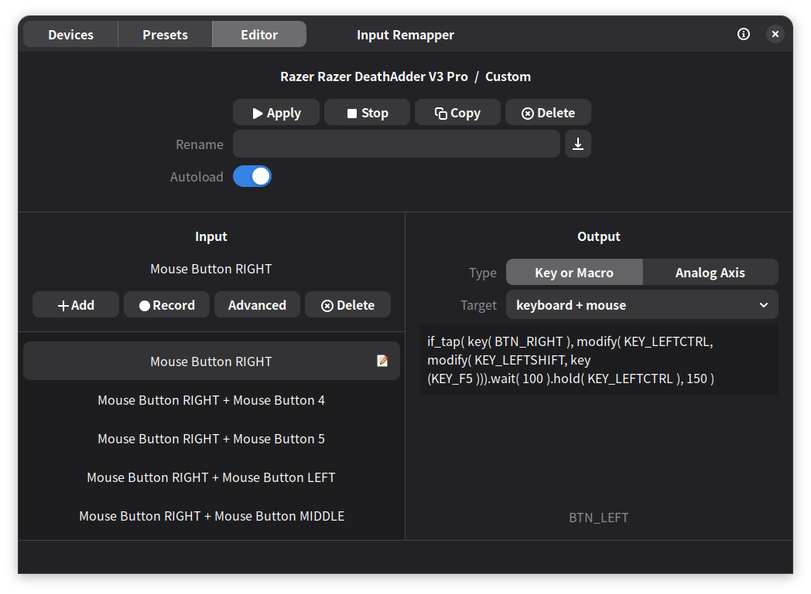

import { Aside, Tabs, TabItem, LinkCard } from '@astrojs/starlight/components';
import { Icon } from 'astro-icon/components';
import Intro from '../../components/Intro.astro';


<Intro>
  On Linux, you can use a tool called [Input Remapper](https://github.com/sezanzeb/input-remapper) to remap mouse buttons or controller buttons to keyboard shortcuts and open Kando menus this way!
</Intro>


# Introduction

**Input Remapper** is a Linux-only tool which allows you to remap mouse or controller buttons to keyboard shortcuts.
While you can use it directly to bind menus to mouse buttons via keyboard shortcuts, it also allows for more advanced setups like showing menus when pressing two mouse buttons at the same time.

Get Input Remapper from GitHub: https://github.com/sezanzeb/input-remapper

You can visit the repository to learn about installation and general usage.
This guide here will focus specifically on how to work with Kando.

 
<center><sup>You can choose which button (on the left) should trigger which actions (on the right).</sup></center>

# Configuration

In this guide, we will explore three ways to trigger a Kando menu through Input Remapper.
First, we will look at the simplest method of directly mapping a mouse button to a keyboard shortcut.
Then, we will explore how to trigger a menu with a long press of a mouse button while keeping the original function on tap.
Finally, we will see how to trigger a menu by holding one mouse button and tapping another.

<Aside type="note" title="Note">
To demonstrate the most complex scenarios, the examples below use `Ctrl+Shift+F1` as the trigger. You can modify this to your preferred shortcut.
</Aside>

## Option 1: Direct Shortcut Mapping

This is the simplest method.
Pressing a single mouse button triggers the Kando menu.
In the Input pane on the left, add a new mapping and record the mouse button you want to use.
In the output pane on the right, set the **type to "Key or Macro"** and the **target to "keyboard"** and type in the shortcut you want to use to trigger the Kando menu:

```yaml
KEY_LEFTCTRL + KEY_LEFTSHIFT + KEY_F1
```

After applying the changes, pressing the mouse button will trigger the Kando menu assigned to `Ctrl+Shift+F1`.

- **Pros**: Fast response with zero latency; simple setup.
- **Cons**: The button loses its original function, only suitable for mice with extra buttons.

## Option 2: Long Press Mouse Button

With the following configuration, a long press triggers the Kando menu, while a short press (tap) retains the button's original function.
The following example uses the **Right Mouse Button**.

First, bind the right mouse button in the Input pane on the left.
Then, in the output pane on the right, set the **type to "Key or Macro"** and the **target to "keyboard + mouse"** and use the following configuration:

```yaml
if_tap( key( BTN_RIGHT ), modify( KEY_LEFTCTRL, modify( KEY_LEFTSHIFT, key (KEY_F1 ))).wait( 100 ).hold( KEY_LEFTCTRL ), 150 )
```

<Aside type="tip" title="Tip">
The number `150` at the end represents the duration required for a long press in milliseconds. You can adjust this value, but setting it too short may lead to accidental triggers.
</Aside>

- **Pros**: Preserves the button's original tap functionality, you can directly engage in Marking Mode by holding the button without the need for an additional mouse click.
- **Cons**: You lose the button's original hold function; holding and dragging will now interact with the Kando menu instead.

## Option 3: Combining Two Mouse Buttons

Triggered by holding one mouse button and tapping another. The following example uses **Hold Right Click + Tap Left Click**:

```yaml
# Mouse Button RIGHT
# Target: keyboard + mouse
if_tap( key( BTN_RIGHT ), hold( KEY_LEFTCTRL ))

# Mouse Button LEFT
# Target: keyboard
KEY_LEFTCTRL + KEY_LEFTSHIFT + KEY_F1
```

- **Pros**: Allows you to hold Right Click and tap Left Click multiple times to quickly toggle between menus assigned to the same shortcut.
- **Cons**: You lose the button's original hold function; holding and dragging will now interact with the Kando menu instead.
