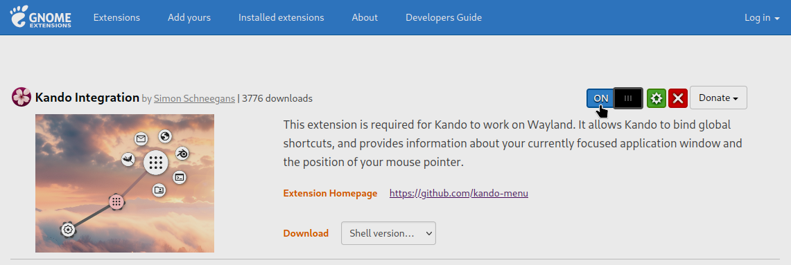
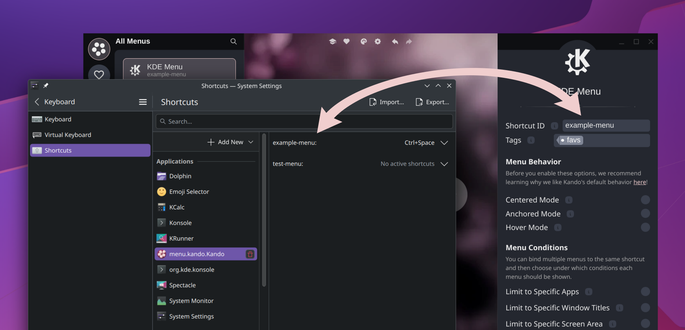
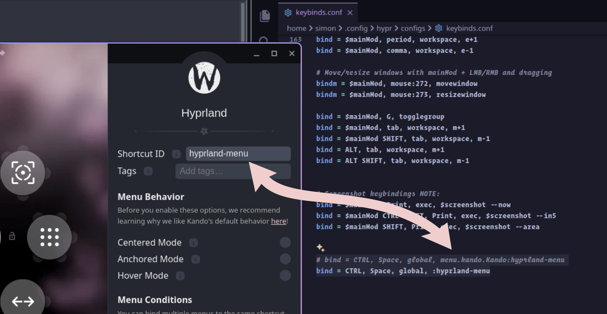

import { Steps, Aside, Tabs, TabItem } from '@astrojs/starlight/components';
import { Icon } from 'astro-icon/components';
import { YouTube } from '@astro-community/astro-embed-youtube';
import CustomAside from '../../components/CustomAside.astro';
import Intro from '../../components/Intro.astro';


<Intro>
On Linux, you can either install Kando from your package manager, or via any of the pre-packaged binaries from GitHub releases.
</Intro>

## <Icon name="solar:check-circle-bold-duotone" class="inline-icon" /> Supported Desktop Environments

Implementing a menu like Kando for various desktop environments is not exactly easy.
Things like getting the mouse position before opening a window, simulating key presses, or getting the name of the currently focused application window may have to be implemented differently.

Environment | Status | Notes
:-- | :---: | ---
GNOME / X11 | ✅ |
GNOME / Wayland | ✅ | Requires [adapter GNOME Shell extension](https://github.com/kando-menu/gnome-shell-integration) which provides a DBus interface for Kando to communicate with.
KDE / X11 | ✅ |
KDE / Wayland | ✅ | Works both on Plasma 5 and Plasma 6. See [below](#-kde-plasma-on-wayland) for how to bind global shortcuts.
Cosmic | ❌ | Contributions are welcome! Read the [corresponding feature request](https://github.com/kando-menu/kando/issues/738).
Hyprland | ✅ | See [below](#-hyprland) for the required configs.
Cinnamon / X11 | ✅ |
Cinnamon / Wayland | ❌ | Contributions are welcome! Read the [corresponding feature request](https://github.com/kando-menu/kando/issues/833).
XFCE | ✅ |
MATE | ✅ |
Budgie | ✅ |
LXQt | ✅ |
LXDE | ✅ | Requires a compositor for the transparency to work.
Openbox | ✅ | Requires a compositor for the transparency to work.
i3 | ✅ | Requires a compositor for the transparency to work.
dusk | ✅ | Requires a compositor for the transparency to work. See [below](#dusk) for the required config.
Qtile | ➖ | It works with some flaws. Contributions are welcome! Read the [corresponding bug report](https://github.com/kando-menu/kando/issues/621).
Niri | ➖ | See [below](#-niri) for the required configs. It works with some flaws. Contributions are welcome!

<CustomAside type="thanks" title="Have you tested another environment?">
If you have tested Kando on another desktop environment, please add it to the list above by editing this page on GitHub!
</CustomAside>

## <Icon name="solar:box-bold-duotone" class="inline-icon" /> Installation via a Package Manager

<Steps>

1. Kando is already available in several package managers. 
   <Tabs>
    <TabItem label="Flathub">
      Kando is [available on Flathub](https://flathub.org/apps/menu.kando.Kando).
      ```bash
      flatpak install flathub menu.kando.Kando
      ```
    </TabItem>
    <TabItem label="AUR">
      You can install [`kando-bin`](https://aur.archlinux.org/packages/kando-bin/) from the AUR.
      ```bash
      yay -S kando-bin
      ```
    </TabItem>
    <TabItem label="NixOS">
      A [`kando`](https://search.nixos.org/packages?channel=24.11&show=kando) package is available in Nixpkgs.
      ```bash
      nix-shell -p kando
      ```
    </TabItem>
    <TabItem label="AM or AppMan">
      You can install Kando from the [AppMan](https://portable-linux-apps.github.io/apps) package manager.
      ```bash
      am -i kando
      ```
    </TabItem>
   </Tabs>

2. After the installation, you can start Kando from your application launcher! Not much will happen, as Kando is a tray application and will run in the background.

3. On most X11 based distributions, you can now press <kbd>Ctrl</kbd> + <kbd>Space</kbd> to open the example menu!
   <Aside type="note" title='This does not work?'>
    On some desktop environments, especially those based on Wayland, you will have to perform some additional steps. Read more in the [Desktop Specifics](#desktop-specifics) section below for more information.
   </Aside>

</Steps>

## <Icon name="solar:zip-file-bold-duotone" class="inline-icon" /> Installation via a Pre-Packaged Binary

<Steps>

1. Just head over to the [releases page](https://github.com/kando-menu/kando/releases) and download a package that fits your distribution.
   <Tabs syncKey="download-type">
    <TabItem label="Ubuntu">
      On Ubuntu and other Debian-based distributions, you can download the `Kando_*_amd64.deb` package.
    </TabItem>
    <TabItem label="Fedora">
      On Fedora and other RPM-based distributions, you can download the `Kando-*.x86_64.rpm` package.
    </TabItem>
    <TabItem label="AppImage">
      The `Kando-*-x86_64.AppImage` package is a universal package that should work on most distributions.
    </TabItem>
    <TabItem label="Zip Archive">
      The `Kando-linux-x64-*.zip` package is a generic package that should work on most distributions.
    </TabItem>
   </Tabs>

2. Install the package. The AppImage and Zip Archive packages are standalone and can be run directly. The other packages need to be installed.
   <Tabs syncKey="download-type">
    <TabItem label="Ubuntu">
      ```bash
      sudo dpkg -i Kando_*_amd64.deb
      ```
      After the installation, you can start Kando from your application launcher! Not much will happen, as Kando is a tray application and will run in the background.
    </TabItem>
    <TabItem label="Fedora">
      ```bash
      sudo rpm -i Kando-*.x86_64.rpm
      ```
      After the installation, you can start Kando from your application launcher! Not much will happen, as Kando is a tray application and will run in the background.
    </TabItem>
    <TabItem label="AppImage">
      ```bash
      chmod +x Kando-*-x86_64.AppImage
      ./Kando-*-x86_64.AppImage
      ```
    </TabItem>
    <TabItem label="Zip Archive">
      ```bash
      unzip Kando-linux-x64-*.zip
      ./Kando-linux-x64/kando
      ```
    </TabItem>
   </Tabs>

3. On most X11 based distributions, you can now press <kbd>Ctrl</kbd> + <kbd>Space</kbd> to open the example menu!
   <Aside type="note" title='This does not work?'>
    On some desktop environments, especially those based on Wayland, you will have to perform some additional steps. Read more in the [Desktop Specifics](#desktop-specifics) section below for more information.
   </Aside>
  
</Steps>

## Desktop Specifics

Implementing a menu like Kando on Wayland is not exactly easy.
Things like getting the mouse position before opening a window, simulating key presses, or getting the name of the currently focused application window does not work out of the box.
Therefore, Kando needs some additional setup on Wayland based desktop environments.
There are also some X11 based desktop environments that need some additional setup.

### <Icon name="simple-icons:gnome" class="inline-icon" /> GNOME on Wayland

[](https://extensions.gnome.org/extension/7068/kando-integration/)

You will also need to install the [🐚 Kando Integration Extension](https://extensions.gnome.org/extension/7068/kando-integration/).
Via a D-Bus interface, it provides the name of the currently focused window, and the current mouse pointer position.
Furthermore, it allows registering and simulating keyboard shortcuts.


### <Icon name="simple-icons:kde" class="inline-icon" /> KDE Plasma on Wayland



If you are using Plasma on Wayland, Kando cannot directly bind global shortcuts.
Instead, it uses the Global-Shortcuts Desktop Portal.
This means, you specify a shortcut ID for each menu in Kando's menu editor.
Once you inserted an ID, the KDE's system settings will pop up automatically and you can assign a shortcut to the ID.

It is perfectly fine to use the same shortcut ID for multiple menus.
Use this in combination with the app-dependent menu feature to open different menus depending on the currently focused application!

### <Icon name="simple-icons:hyprland" class="inline-icon" /> Hyprland



Kando works quite well on Hyprland, but you will need to do some additional setup.

#### Window Rules

You will need some window rules for Kando.
Else, the menu will not float above other windows.

```
// ~/.config/hypr/hyprland.conf
windowrule = noblur, class:kando
windowrule = opaque, class:kando
windowrule = size 100% 100%, class:kando
windowrule = noborder, class:kando
windowrule = noanim, class:kando
windowrule = float, class:kando
windowrule = pin, class:kando
```

#### Shortcuts

Also, Kando cannot directly bind global shortcuts on Hyprland.
Instead, you specify a shortcut ID for each menu in Kando's menu editor and bind a key combination in `hyprland.conf`.
For this, do the following:

<Steps>

1. Run Kando and set a shortcut ID for your menu in the menu editor.
2. Open a terminal and run `hyprctl globalshortcuts` to list all currently registered global shortcuts.
3. Find the line that corresponds to your shortcut ID and add a line like `bind = CTRL, Space, global, <shortcut ID>` to your `hyprland.conf`.

</Steps>

The shortcut ID will look different depending on how you installed Kando.
Here are some examples:

<Tabs>
  <TabItem label="Flathub">
    ```
    // ~/.config/hypr/hyprland.conf
    bind = CTRL, Space, global, menu.kando.Kando:example-menu
    ```
  </TabItem>
  <TabItem label="Most other installations">
    ```
    // ~/.config/hypr/hyprland.conf
    bind = CTRL, Space, global, :example-menu
    ```
  </TabItem>
</Tabs>


#### Use Wayland instead of XWayland

Per default, Electron apps like Kando run under XWayland.
On Hyprland, this can lead to some glitchy behavior like menus opening not at the cursor or dropdown menus not working correctly.
You can fix this by making your Electron apps run under Wayland instead of XWayland.
To do this, add the following line to your config:

```
// ~/.config/hypr/hyprland.conf
env=ELECTRON_OZONE_PLATFORM_HINT,auto
```

#### Input Issues

Toggling Special-Workspace through kando-menu will be glitchy (i.e in some cases special-workspace will reopen instead of closing). See https://github.com/kando-menu/kando/issues/784.

After triggering kando-menu-item of type `Run command` whose target is `activewindow` will not work correctly as by default Hyprland restores focus_on_close to next candidate window. See https://github.com/kando-menu/kando/issues/812.

Both of above can be solved by using the following config:
```
// ~/.config/hypr/hyprland.conf
input {
    special_fallthrough = true # having only floating windows in the special workspace will not block focusing windows in the regular workspace.
    focus_on_close = 1 # focus will shift to the window under the cursor.
}
```

Using the solution for 2nd step might not work in situations where the target window is small as you will travel out of target area while activating items from sub-menu. For that you can use `hyprctl dispatcher focusurgentorlast` or `hyprctl dispatcher focuscurrentorlast` instead. See https://wiki.hyprland.org/Configuring/Dispatchers/#list-of-dispatchers.

### <Icon name="simple-icons:wayland" class="inline-icon" /> Niri

You will need some window rules for Kando.
Else, the menu will not float above other windows.

```
// ~/.config/niri/config.kdl
window-rule {
    match title="Kando Menu"
    open-floating true
    border { off; }
    shadow { off; }
}
```

Hotkey simulation through Kando will not work for triggering keybinds registered in your Niri configuration.
In that case, have Kando run a command `niri msg action <action>` where the action is the one configured in the your configuration along with its arguments (for example `niri msg action focus-workspace-up` or `niri msg action focus-workspace 1`).

Niri does not yet support global shortcuts.
But you can open menus using `kando --menu "Menu Name"` from the command line or from your Niri config.

### Dusk

On Dusk, you will have to install and use a compositor like `picom` or `compton` to make the transparency work.
Also, you will need some window rules for Kando:
```cpp
// dusk/config.def.h
static const Rule clientrules[] = {
  { .class = "kando", .flags = FullScreen }, //kando should be on top of DOCK clientrule
  { .wintype = WTYPE "DESKTOP", .flags = Unmanaged|Lower },
  { .wintype = WTYPE "DOCK", .flags = Unmanaged|Raise },
};
```

### LXDE, i3, Openbox, and others

On some minimal desktop environments, you will have to install and use a compositor like `picom` or `compton` to make the transparency work.
