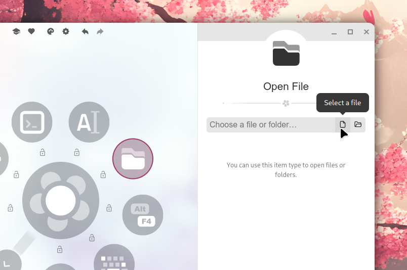

import Intro from '../../components/Intro.astro';
import { Icon } from 'astro-icon/components';
import { Tabs, TabItem, Steps } from '@astrojs/starlight/components';



<Intro>
With this menu item, you can open a file or directory.
While you could also use the "Run Command" or "Open URI" item types for this, the "Open File" provides file pickers for both files and directories.
</Intro>


## <Icon name="solar:settings-bold-duotone" class="inline-icon" /> Example Configuration

If you happen to edit your `menus.json` file by hand, you can create an open-file item with something like the following.
You can read more about the structure of the `menus.json` file in its [documentation](/config-files).

```json title="menus.json"
// ...
{
  "type": "file",
  "name": "Open File",
  "icon": "file-item.svg",
  "iconTheme": "kando",
  "data": {
    "path": "/path/to/file.txt",
  }
},
// ...
```