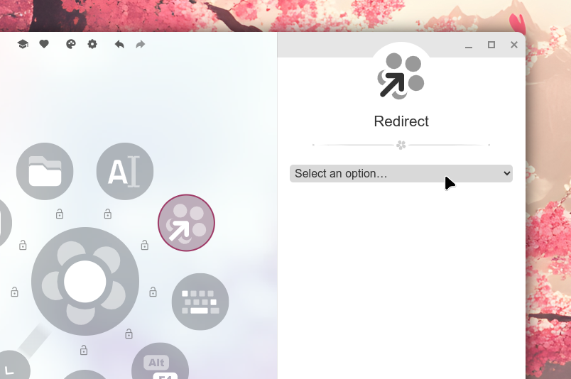

import Intro from '../../components/Intro.astro';
import { Icon } from 'astro-icon/components';
import { Tabs, TabItem, Steps } from '@astrojs/starlight/components';



<Intro>
With this menu item, you can create a link to another menu.
The linked menu will be opened when the user clicks on this item.
</Intro>


## <Icon name="solar:settings-bold-duotone" class="inline-icon" /> Example Configuration

If you happen to edit your `menus.json` file by hand, you can create a redirect item with something like the following.
You can read more about the structure of the `menus.json` file in its [documentation](/config-files).

```json title="menus.json"
// ...
{
  "type": "redirect",
  "name": "Main Menu",
  "icon": "all-menus.svg",
  "iconTheme": "kando",
  "data": {
    "menu": "Main Menu"
  }
},
// ...
```