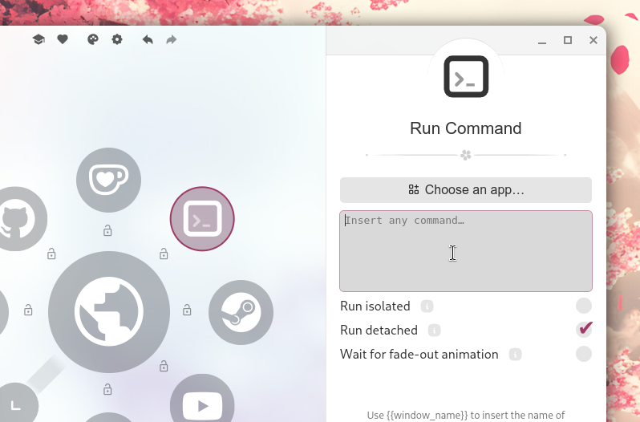

import Intro from '../../components/Intro.astro';
import { Icon } from 'astro-icon/components';
import { Tabs, TabItem, Steps, Badge, Icon as AstroIcon } from '@astrojs/starlight/components';



<Intro>
This item type is used to execute any command.
You can use this to run applications, scripts, or any other command that you can run in a shell.
</Intro>

## <Icon name="solar:menu-dots-circle-bold-duotone" class="inline-icon" /> Getting the Command to Run an App

Starting with version 2.1.0, Kando comes with an **app picker** which allows you to select one of your installed applications.
If the app picker does not show the app you want to run, you can use tips further below to find the command to run the app.

### Use the App Picker (recommended) <Badge text="new!" variant="tip" />
If you select an application from the app picker, Kando will automatically fill in the command, name, and icon for you.

<center><sup>The app picker allows you to select one of your installed of apps.</sup></center>

### Use Drag and Drop <Badge text="new!" variant="tip" />
Usually, you can drag and drop an application from your start menu or application launcher into Kando!
* On **Windows**, this works with the Start Menu and most application shortcuts.
* On **macOS**, you can drag and drop applications from the Applications folder.
* On **Linux**, you can drag and drop desktop files from your file manager and on some desktop environments, you can also drag and drop applications from the application launcher.

### <AstroIcon name="seti:windows" class="inline-icon" /> Windows
If the app picker does not work for you, you can find the command to run an application in a few different ways.
The steps for launching an application on Windows depends on where it is and what type of application it is.
<Tabs>
  <TabItem label="Start Menu Apps">
    <Steps>
      1. Find the application launcher in your start menu.

      2. Right-click on the application and select "Open file location".

      3. Right-click on the application shortcut and select "Properties".

      4. In the properties window, you will find the "Target" and "Start in" fields. The "Target" field contains the command you need to run the application. The "Start in" field contains the working directory of the application. Note both of these down.

      5. For the command in Kando, use the following format and copy the "Start in" and "Target" fields into the command:
          ```bash
          start "" /D "Start in" "Target"
          ```
    </Steps>
  </TabItem>
  <TabItem label="UWP Apps">
    <Steps>
      1. Press <kbd>Win</kbd> + <kbd>R</kbd>.

      2. Type in ```shell:appsfolder``` and press OK or <kbd>Enter</kbd>.

      3. Drag the icon for the UWP application you want to launch in a folder, preferably the Desktop for easy access. Optionally, you can right-click on the icon, click "Create shortcut", and click "Yes" on the prompt.

      4. Right-click on the application shortcut and select "Properties".

      5. In the properties window, you will find the “Target” and “Start in” fields. If they do not seem cut off, you can move on to step 7. If they do seem cut off, or the command did not find the application with what you typed, continue to the next step instead.

      6. Use an application like [Easy Link File Viewer](https://github.com/ElektroStudios/Easy-Link-File-Viewer) or [LECmd](https://ericzimmerman.github.io) to view your shortcut file. You should see it in the "Target" field in Easy Link File Viewer and the "App User Model ID" field in LECmd.

      7. For the command in Kando, use the following format and replace `Application` with the name of your UWP app:
          ```bash
          start "" "shell:appsfolder\Application"
          ```

         For example, the launch command for Notepad in Windows 11 would be:
          ```bash
          start "" "shell:appsfolder\Microsoft.WindowsNotepad_8wekyb3d8bbwe!App"
          ```
    </Steps>
  </TabItem>
  <TabItem label="Other Apps">
    <Steps>
      1. Right-click on the application and select "Create shortcut".

      2. Right-click on the application shortcut and select "Properties".

      3. In the properties window, you will find the "Target" and "Start in" fields. The "Target" field contains the command you need to run the application. The "Start in" field contains the working directory of the application. Note both of these down.

      4. For the command in Kando, use the following format and copy the "Start in" and "Target" fields into the command:
          ```bash
          start "" /D "Start in" "Target"
          ```
    </Steps>
  </TabItem>
</Tabs>
### <AstroIcon name="apple" class="inline-icon" /> macOS
On macOS, you can usually run an application from the terminal by using the `open` command.
```bash
open -a "Application Name"
```

### <AstroIcon name="linux" class="inline-icon" /> Linux
On Linux, this is pretty straightforward. Just use the command you would use to run the app from a terminal.
If you do not now this, you can have a look at the desktop file of the app you want to run. This file is usually located in `/usr/share/applications/` or `~/.local/share/applications/`. The `Exec` line in this file contains the command you need to run.

## <Icon name="solar:check-circle-bold-duotone" class="inline-icon" /> Options

There are a few other options you can set for the command item:

* **Run isolated:** This is only available on Linux with `systemd-run` installed. This will run the command in a clean environment, meaning that it will not inherit any environment variables from Kando. This can help with commands that do not start properly.
* **Run detached:** This will disconnect the command from Kando, so it will continue to run even if Kando is closed. Disabling this may resolve issues with commands that do not start properly.
* **Wait for fade-out animation:** If enabled, the command will be executed _after_ the Kando window is closed. This can be useful if the command targets another window which needs to be focused.

## <Icon name="solar:code-line-duotone" class="inline-icon" /> Placeholders

You can use placeholders in the command which will be replaced by some actual values when the command is executed.
This allows for some very advanced use-cases!
Below are the available placeholders:

- `{{app_name}}`: The name of the application which was focused when the menu was opened.
- `{{window_name}}`: The title of the window which was focused when the menu was opened.
- `{{pointer_x}}`: The x-coordinate of the mouse pointer when the menu was opened.
- `{{pointer_y}}`: The y-coordinate of the mouse pointer when the menu was opened.

## <Icon name="solar:settings-bold-duotone" class="inline-icon" /> Example Configuration

If you happen to edit your `menus.json` file by hand, you can create a Command item with something like the following.
You can read more about the structure of the `menus.json` file in its [documentation](/config-files).

The `data` property of the menu item must contain a `command` property which contains the shell command to execute.
The optional `delayed` property will ensure that the command is executed _after_ the Kando window is closed.

```json title="menus.json"
// ...
{
  "name": "Inkscape",
  "type": "command",
  "icon": "inkscape",
  "iconTheme": "simple-icons",
  "data": {
    "command": "/usr/bin/inkscape",
    "delayed": false
  }
},
// ...
```