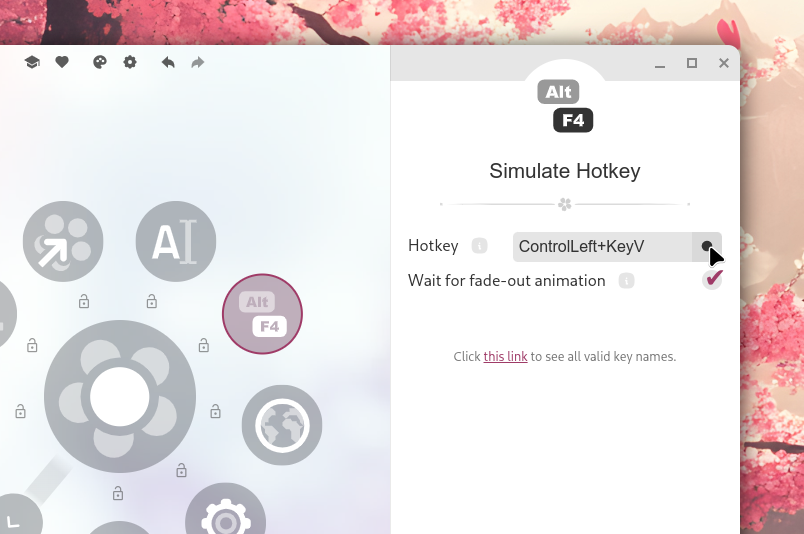

import Intro from '../../components/Intro.astro';
import { Icon } from 'astro-icon/components';
import { Tabs, TabItem, Steps, Aside } from '@astrojs/starlight/components';



<Intro>
This type is used to simulate simple keyboard events.
You can use this to trigger shortcuts in other applications to automate tasks.
</Intro>

You can use the menu editor to record a hotkey or directly type the hotkey into the corresponding field.
The latter is useful if you want to use a hotkey that is either not available on your keyboard or is globally bound to another application.

You can also type the keys one after another: If you want to simulate <kbd>Alt</kbd> + <kbd>F4</kbd>, you can press <kbd>Alt</kbd> first, release it, then press <kbd>F4</kbd>.
Else this would close the Kando window!

<Aside type="tip">
See [Valid Key Names](/valid-keynames) for details on the format of the hotkey.
</Aside>

## <Icon name="solar:check-circle-bold-duotone" class="inline-icon" /> Options

The item has an optional **Wait for fade-out animation** property which you can enable or disable.
If enabled, the hotkey will be executed _after_ the Kando window is closed.
This can be useful if the shortcut targets another window which needs to be focused.

## <Icon name="solar:settings-bold-duotone" class="inline-icon" /> Example Configuration

If you happen to edit your `menus.json` file by hand, you can create a Hotkey item with something like the following.
You can read more about the structure of the `menus.json` file in its [documentation](/config-files).

The `data` property of the menu item must contain a `hotkey` property which contains the hotkey to simulate.
The optional `delayed` property will ensure that the hotkey is executed _after_ the Kando window is closed.

```json title="menus.json"
// ...
{
  "name": "Paste",
  "type": "hotkey",
  "icon": "content_paste_go",
  "iconTheme": "material-symbols-rounded",
  "data": {
    "hotkey": "ControlLeft+KeyV",
    "delayed": true
  }
},
// ...
```