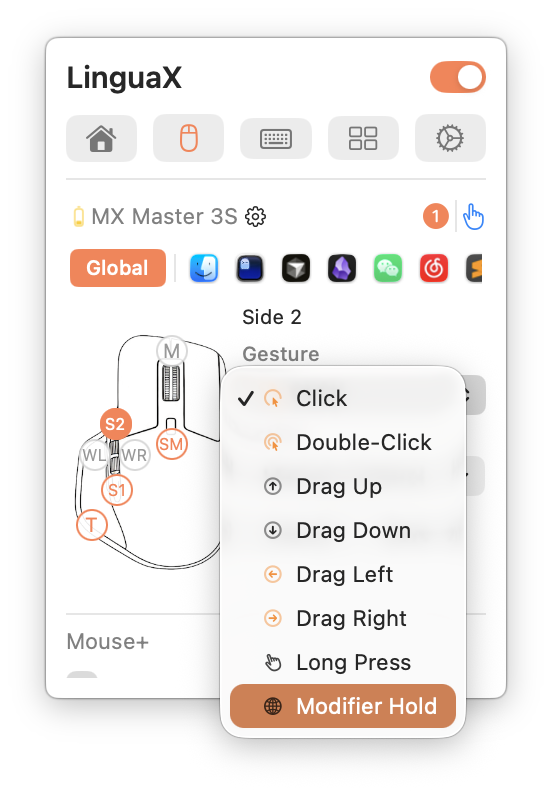
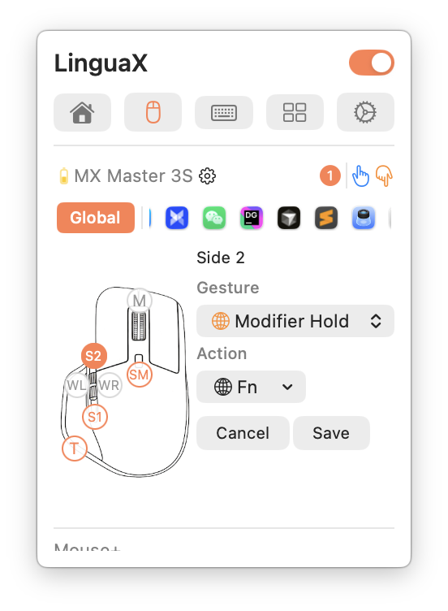

import { Steps } from '@astrojs/starlight/components';
import Intro from '../../components/Intro.astro';
import {Image} from 'astro:assets';

<Intro>
  [LinguaX](https://linguax.app/) is a macOS menu-bar app which combines automatic input-source switching with mouse-button remapping.
  You can use it to open a Kando menu via a mouse button.
</Intro>

## Configuration

<Steps>
    1. Open LinguaX from the menu bar and switch to the 'Mouse' tab.
    2. Select your mouse and click the button you want to use (for example a side button).
    3. Choose the 'Click' gesture for this button.
    4. Set the 'Action' to 'Keyboard Shortcut' and record the hotkey which opens your Kando menu.
    5. For example, you can send <kbd>Ctrl</kbd>+<kbd>F13</kbd> when pressing the mouse button.
    6. Save the mapping and adjust it to your own needs (if necessary).
</Steps>

| Selecting the Click gesture for a mouse button           | Choosing the action for a mouse button                 |
| -------------------------------------------------------- | ------------------------------------------------------ |
|  |  |

