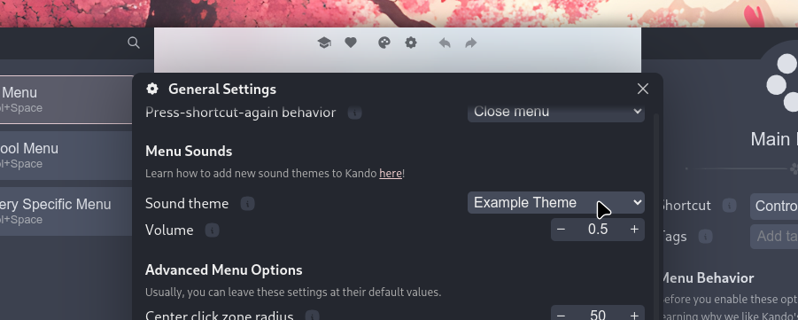

import { CardGrid, Aside, Tabs, TabItem, Steps, Badge, FileTree } from '@astrojs/starlight/components';
import CustomCard from '../../components/CustomCard.astro';
import Intro from '../../components/Intro.astro';
import { Icon } from 'astro-icon/components';


<Intro>
Kando can play sound effects when you open the menu or select an item.
This can be a fun way to make your desktop more lively!
</Intro>

<Aside type="tip" title="Get sound themes online!">
For now, Kando comes with no sound themes pre-installed.
HoweverYou can find sound themes in the [Kando Sound Themes Repository](https://github.com/kando-menu/sound-themes)!
</Aside>

## <Icon name="solar:cloud-download-bold-duotone" class="inline-icon" /> Installing Sound Themes

A sound theme is a directory containing a `theme.json` and some audio files.
If you want to install such a theme, you should put it into the `sound-themes` directory.
The location of this directory depends on your operating system:

<Tabs syncKey="os" >
  <TabItem label="Windows" icon="seti:windows">
    ```
    %appdata%\kando\
    ```
  </TabItem>
  <TabItem label="macOS" icon="apple">
    ```
    ~/Library/Application Support/kando/
    ```
  </TabItem>
  <TabItem label="Linux" icon="linux">
    ```
    ~/.config/kando/
    ```
  </TabItem>
  <TabItem label="Flatpak" icon="linux">
    ```
    ~/.var/app/menu.kando.Kando/config/kando/
    ```
  </TabItem>
</Tabs>

<FileTree>
- kando
  - icon-themes/
  - menu-themes/ 
  - sound-themes/ Put your theme folder in here.
    - some-sound-theme/ The directory name can be anything you like.
      - theme.json
      - sound1.wav
      - sound2.wav
      - ...
  - config.json
  - menus.json
</FileTree>


## <Icon name="solar:headphones-square-sound-bold-duotone" class="inline-icon" /> Selecting a Sound Theme

To open the settings menu, click on the gear icon in the bottom right corner of the menu.
Then click on the tiny gear icon in the toolbar at the top of the menu editor.

 
<center><sup>You can select a sound theme in the settings menu.</sup></center>

This will open the general settings menu.
Scroll down to the "Menu Sounds" section.
Here you can select a sound theme from the dropdown menu and adjust the volume of the sounds.

<Aside type="tip" title="Do you want to create your own sound themes?">
There's a guide on [how to create your own themes](/create-sound-themes) available!
</Aside>