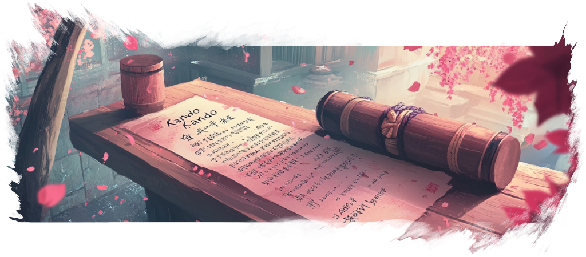

import { LinkButton } from '@astrojs/starlight/components';
import Intro from '../../components/Intro.astro';
import CustomAside from '../../components/CustomAside.astro';
import {Image} from 'astro:assets';

import achievements from '../../assets/img/achievements.png';

<Intro>
Translations are managed via Weblate.
To get started, simply click the button below, create an account, and start translating!

<LinkButton
    href="https://hosted.weblate.org/engage/kando/"
    icon="external"
    iconPlacement="start"> 
  Translate Kando on Weblate!
 </LinkButton>
</Intro>

Nearly all strings on Weblate come with a context screenshot, so you can see where they are used in the application.
In case something is not clear, feel free to ask for help on our [Discord Server](https://discord.gg/hZwbVSDkhy)!

The only real challenge will be the translation of the achievements.
Hence, we have created a separate guide for this task below.

## Translating Achievements

Translating achievements can be a bit tricky, as several achievements contain placeholders for variables (like `{{n}}`, `{{tier}}`, or `{{attribute}}`) which will be replaced by strings which can be translated as well 🤯.

<Image src={achievements} alt="menu editor" class="shadow"/>

Kando's achievement dialog.

The image above shows some typical achievements that can be translated.
In the following, we will first explain the structure of _achievement names_ (the bold text above) and then the structure of _achievement descriptions_ (the normal text below the bold text).

### Achievement Names

Some achievement names contain either the placeholder `{{tier}}` or `{{attribute}}`.
- In English, `{{tier}}` will be replaced by the roman numbers "I", "II", "III", "IV", or "V". For instance, in the screenshot above, the achievement "The Journey is the Reward IV" contains the placeholder `{{tier}}` at the end which was replaced by "IV". When translating this achievement name, make sure to keep the placeholder `{{tier}}` in the correct position for your language. The five tiers can be translated as well! So you do not have to keep the roman numbers if your language has a better way to express this.
- The placeholder `{{attribute}}` will be replaced in a similar way. In English, it will be replaced by one of the words "Novice", "Capable", "Skilled", "Expert", or "Sensei". For instance, the "Skilled Slicer" achievement in the screenshot above contains the placeholder `{{attribute}}` at the beginning. So the user will progress from a "Novice Slicer" to a "Sensei Slicer" over time. Again, the five attributes can be translated as well!
  
As you can see, there's a lot of flexibility when translating achievement names.
With some creativity, you can come up with great translations that fit your language perfectly!
You do not have to stick to the English structure if your language allows for a better expression.  

### Achievement Descriptions

Achievement descriptions often contain placeholders as well.
Usually, it will be `{{n}}` which will be replaced by a number.
However, there are also some more complex cases where multiple placeholders are used.
For instance, the English string for the description of the "Skilled Slicer" achievement is `Select {{n}} items at depth {{depth}} in less than {{time}} ms`.

You can change the order of the placeholders in your translation if your language requires a different sentence structure.

<CustomAside type="thanks" title="Thank you!">
If you made it this far: Thank you so much!
Translating Kando into your language is a great way to contribute to the project.
At the same time, it is a very valuable contribution, as it makes Kando accessible to more people around the world.
</CustomAside>
